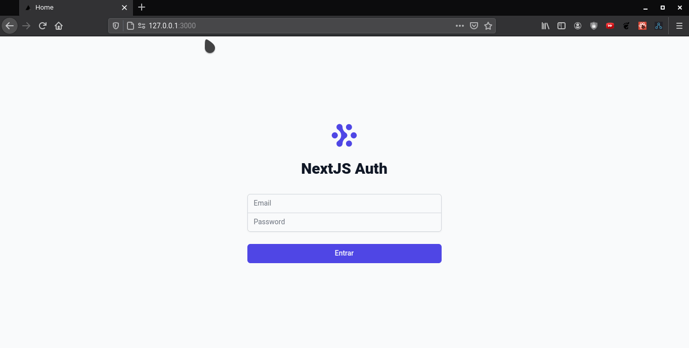

# NextJSAuth - ReactJS                                                     
                                  
<p align="center">
 
</p>
This code was developed based on an Youtube video by RocketSeat

## ⚡️ The Project
  This project explores the NextJS authentication control based on a JWT Authentication, cookies as storage and SSR (Server Side Rendering) verification to check user's permissions and authenticated state. The project has two pages, the Login page can be acessed only by not authenticated users, and the dashboard can only be acessed by authenticated users.
  
## 🎯 Features
 - SSR
 - Cookies
 - JWT simulation
 - Authentication permissions treatment 
  
## 🖥️ Used Tecnologies
 - [ReactJS](https://reactjs.org/)
 - [NextJS](https://nextjs.org/)

## ⚙️ Dependencies
 - [Yarn](https://yarnpkg.com/)
 
## 🚀️ Getting Started

1. Clone this repository: 

```bash
git clone https://github.com/avnerjose/reactjs-nextjs-jwtssrauth.git
```
2. Install all dependencies

```bash
  yarn
```
3. Go to the folder you cloned the repository and start the app
```base
yarn dev
```
4. Go to LocalHost:3000 to see the result 
